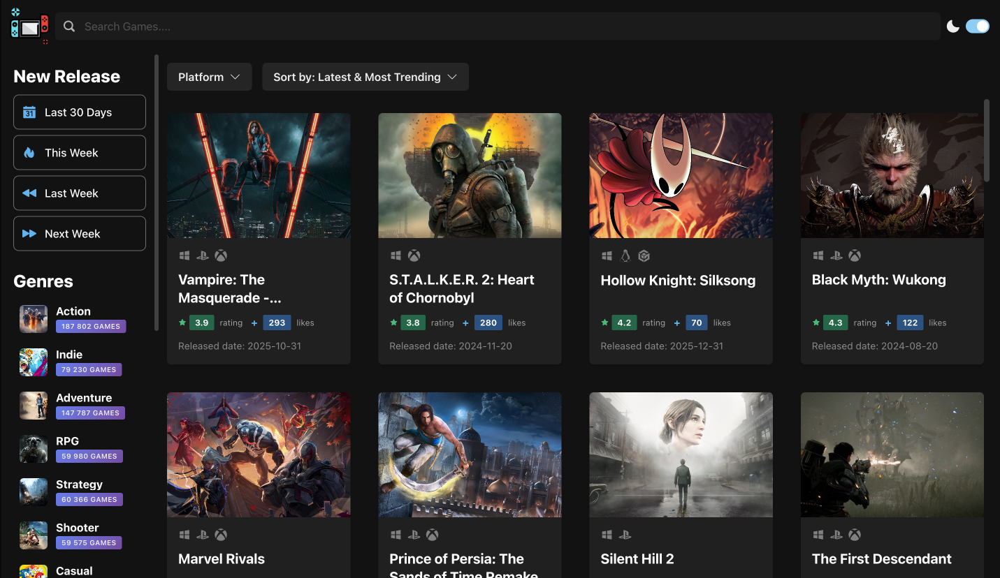
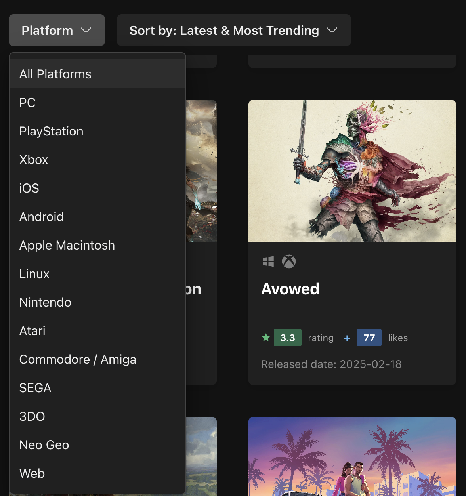
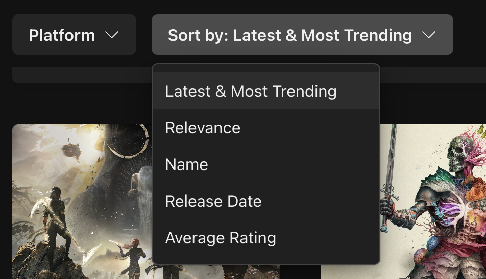
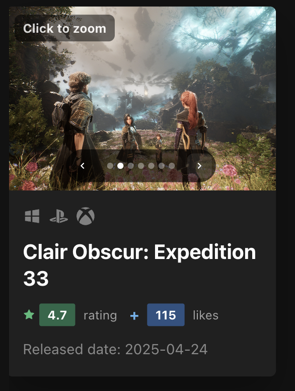

# 🎮 GameHub - Modern Game Discovery Platform

> One of my very first projects (built in 2023). I just gave the codebase a small refactor.

[](https://game-fan.netlify.app)
[](https://react.dev/)
[](https://www.typescriptlang.org/)
[](https://vitejs.dev/)
[](https://chakra-ui.com/)

## 🚀 Tech Stack

### **Frontend Framework**
- **React 18** + **Vite 4** – ultra-fast development experience.
- **TypeScript 5** – strict type-safety.

### **State & Data**
- **Zustand** – lightweight global store.
- **@tanstack/react-query 3** – server-state management, caching & infinite queries ([docs](https://tanstack.com/query/v3)).
- **Axios** – REST requests to **RAWG Video Games Database API** ([API docs](https://rawg.io/apidocs)).

### **Styling & UI**
- **Chakra UI 2** – component system.
- **Framer Motion** – animations.

### **Tooling**
- **ESLint** + **Prettier** – code quality & formatting.
- **Vite** – bundler & preview.

## 🎯 Key Features

- 🔍 Search & filter games by genre, platform and release date.  
- ↕️ Sort results by popularity, rating or release date.  
- ♾️ Infinite Scroll – seamless page loading.  
- 🖼️ Game cards with screenshot gallery & image zoom.  
- 🔞 +18 blur gate for adult content.  
- 🌗 Responsive design with light & dark mode.  

## 🖼️ Features Showcase

### Landing Page


### Platform & Sort Select
 

### Interactive Game Card


### Fullscreen Preview


## ✨ Technical Notes

- Additional screenshots are fetched lazily on card hover.  
- Infinite scrolling powered by `useInfiniteQuery` + `IntersectionObserver`.  
- Clean Zustand store without boilerplate.  

## 🏗️ Project Structure

```text
game-hub/
├── src/
│   ├── components/        # UI & layout
│   ├── hooks/             # Custom React hooks
│   ├── services/          # API layer (RAWG)
│   ├── entities/          # Type definitions
│   ├── assets/            # Static images
│   └── store.ts           # Zustand store
├── public/                # Static assets + readme screenshots
├── index.html
├── package.json
└── vite.config.ts
```

## 🌐 Deployment

- **Production**: [game-fan.netlify.app](https://game-fan.netlify.app)

---

**Indie side-project for gamers – built for learning & fun 🎉**
